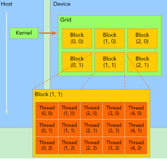

## 基础概念

* GPU: Graphic Processing Unit

* CUDA: Compute Unified Device Architecture

* SP(streaming processor): 最基本的处理单元，也称CUDA core(小核)

* SM(streaming multiprocessor): 多个SP加上其它的一些资源组成一个SM，也称GPU大核

  * thread: 一个 CUDA 的并行程序会被以许多个 threads 来执行
  * block: 数个 threads 会被组成一个 block, 同一个 block 中的 threads 可以同步,
也可以通过 shared memory 通信
  * grid(dimension): 多个 blocks 则会再构成 grid.

    

同一个warp中的thread可以以任意顺序执行, active warps 被SM资源限制. 当一个warp空闲时, SM就可以调度驻留在该SM中另一个可用warp. 在并发的warp之间切换是没什么消耗的, 因为硬件资源早就被分配到所有thread和block, 所以该新调度的warp的状态已经存储在 SM 中了. CPU 切换线程需要保存/读取线程上下文 (register内容), 这是非常耗时的, 而GPU为每个threads提供物理register, 无需保存/读取上下文

## CUDA 编程基本概念

CUDA 的操作概括来说包含 6 个步骤:

• CPU 在 GPU 上分配内存: cudaMalloc

• CPU 把数据发送到 GPU: cudaMemcpy

• CPU 在 GPU 上启动 kernel, 它是自己写的一段程序, 在每个线程上运行

• CPU 等待 GPU 端完成之前 CUDA 的任务: cudaDeviceSynchronize

• CPU 把数据从 GPU 取回: cudaMemcpy

• CPU 释放 GPU 上的内存: cudaFree
